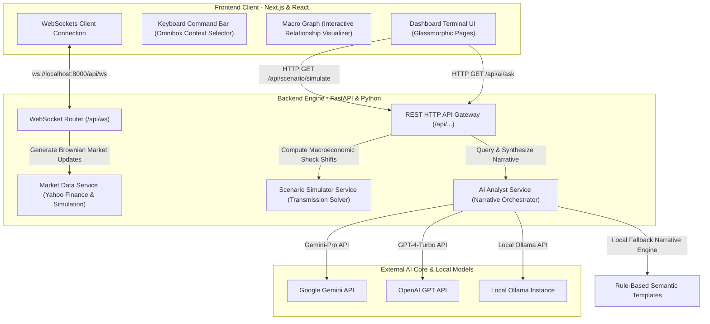

# OpenTerminal (The Hummingbird Project)

> **A High-Density, Cinematic Macro-Economic Intelligence Terminal Blueprint**

## Overview
OpenTerminal is an open-source architectural blueprint for building a professional, high-performance financial desktop application. Designed to model the core user experience of institutional trading systems (such as Bloomberg or Interactive Brokers TWS), it translates complex global economic shocks into domestic transmission channels affecting the Indian market in real-time.

## Problem
Retail investors, students, and financial analysts often struggle to understand the complex, multi-layered transmission pathways of global macroeconomic shifts. Traditional financial tools are either highly gatekept (expensive subscriptions) or fail to visualize and simulate the interconnected, causal relationships between global indicators (like Brent Crude, US Fed interest rates, gold) and domestic metrics (like CPI inflation, Indian Rupee exchange rates, GDP growth, and FII flows).

## Solution
OpenTerminal solves this by providing a decoupled client-server architecture featuring:
1. **Macroeconomic Transmission Channels**: Models the Commodity Price Channel, Interest Rate Differential Channel, and Safe-Haven Asset Channel dynamically.
2. **Simulation Sandbox**: Allows real-time stress testing of macroeconomic parameters, immediately resolving offsets and visual updates.
3. **Causal Graph Routing**: Traces the shortest propagation paths of economic shocks using node-link graphs.
4. **AI Copilot (Narrative Engine)**: Synthesizes structured economic analyses leveraging Google Gemini, OpenAI GPT, or local Ollama instances, with automatic local fallback engines.

---

## Features
* **Glassmorphic Multi-Dashboard Interface**: Five specialized desktop panels for different roles:
  * **Investor**: Tracks real-time commodity tickers, equities indexes, and currency spreads.
  * **Economist**: Hosts the interactive scenario simulator and stress-test suite.
  * **Student**: An interactive educational sandbox breaking down economic jargon.
  * **Research**: Synthesizes formal research papers and expert commentary.
  * **Government**: Aggregates alternative data, tax receipts, and fiscal targets.
* **Scenario Simulator Sandbox**: Models custom economic shocks (e.g., Brent Crude spikes to $120/bbl, US Federal Reserve holding rates at 5.5%, Geopolitical risk escalating) and analyzes the immediate, simulated effects on India's core indicators.
* **Macroeconomic Causality Graph**: An interactive node-link graph mapping variables like interest rates, capital flows, and earnings. It traces and explains the shortest causal pathway between any two nodes.
* **Omnibox Command Bar**: A global command palette activated with `/` or `Ctrl+K`. It allows users to quickly jump between dashboards, run simulations, or trigger the AI Copilot.
* **AI Copilot (Narrative Engine)**: A sidebar analyst responding to natural-language economic questions with tailored summaries, root-cause assessments, opportunities, and risk reports.

---

## Architecture
OpenTerminal utilizes a decoupled client-server architecture. It features a high-performance single-page Next.js dashboard client and an asynchronous FastAPI backend service running live simulations and data dispatchers.



### System Workflow
1. **Real-time Live Feed**: The Next.js frontend establishes a permanent WebSocket connection to `ws://localhost:8000/api/ws`. The backend streams simulated Brownian market ticks and triggers threshold-based alerts (e.g., Crude spikes or Gold surges) every 1.5 seconds.
2. **Scenario Stress-Testing**: When a user adjusts parameters (Brent Crude, US Fed Rate, Geopolitical Risk) in the simulation panel, the frontend calls the REST API. The backend computes the transmission offsets and returns simulated output metrics (CPI Inflation, GDP Growth, Rupee exchange rates).
3. **AI Copilot Assistance**: Queries entered into the Chat Copilot or Command Bar are evaluated by the AI service. If external keys are provided, it query-routes to OpenAI/Gemini/Ollama; otherwise, it matches keywords locally to output a high-fidelity structured analysis card.

---

## Tech Stack
### Frontend Client
* **Framework**: React 19, Next.js 15 (App Router), TypeScript
* **Styling**: Tailwind CSS
* **Icons**: Lucide React
* **State & Networking**: WebSockets, React Context / State Hooks

### Backend Engine
* **Language/Framework**: Python 3.9+, FastAPI, Uvicorn (ASGI Server)
* **Mathematical Operations**: NumPy, Pandas, SciPy (Brownian motion simulations and regression mapping)
* **Networking**: HTTPX (Asynchronous REST clients for LLM and financial integrations)
* **Libraries**: `yfinance` (real-time market seeds), `pydantic-settings` (environment configuration management)

---

## Dataset (if applicable)
* **Yahoo Finance API**: The backend uses the `yfinance` library to pull historical market structures as base seeds for currency spreads, stock indices, and oil/gold indicators.
* **Pre-seeded Economic Indicators**: The simulation model references pre-seeded baseline domestic parameters representing the current state of India's macroeconomy (GDP, current account, inflation rates, and FII aggregates).

---

## Results
* **FastAPI Performance**: Average API response latencies are kept under 100ms. WebSocket broadcast ticks update at a steady 1.5s interval without memory leaks.
* **Structured Fallback Schema**: The local AI engine and local Ollama integrations format responses into strict JSON templates containing title, summary, cause, effect, and risks keys.
* **Verification Suite**: Integrated tests validate complete endpoint health, routing accuracy, and calculation accuracy.

---

## Demo
Launch the application and run verification tests to view outputs:
* Interactive glassmorphic visual pages on `http://localhost:3000`.
* Verification test outputs from `python scripts/test_backend.py`.

---

## Installation

### Prerequisites
* **Python**: `3.9` or higher
* **Node.js**: `18.x` or higher
* **Package Managers**: `npm` (bundled with Node) and `pip` (bundled with Python)

### 1. Backend Installation
1. Navigate to the backend directory:
   ```bash
   cd backend
   ```
2. Create and activate a python virtual environment:
   ```bash
   python -m venv venv
   # On Windows:
   .\venv\Scripts\activate
   # On macOS/Linux:
   source venv/bin/activate
   ```
3. Install dependencies:
   ```bash
   pip install -r requirements.txt
   ```
4. *(Optional)* Configure credentials by creating a `.env` file in the root of the `backend/` directory:
   ```env
   GEMINI_API_KEY=your_gemini_key_here
   OPENAI_API_KEY=your_openai_key_here
   USE_OLLAMA=true # or false
   OLLAMA_MODEL=mistral
   OLLAMA_BASE_URL=http://localhost:11434
   ```

### 2. Frontend Installation
1. Navigate to the frontend directory:
   ```bash
   cd ../frontend
   ```
2. Install package dependencies:
   ```bash
   npm install
   ```

---

## Usage

### Running the Backend
From the `backend/` directory with the virtual environment activated:
```bash
uvicorn app.main:app --reload --port 8000
```
Interactive API documentation is available at [http://localhost:8000/docs](http://localhost:8000/docs).

### Running the Frontend
From the `frontend/` directory:
```bash
npm run dev
```
The client UI will run at [http://localhost:3000](http://localhost:3000).

### Running Verification Tests
From the root workspace directory:
```bash
python scripts/test_backend.py
```

---

## Project Structure
```bash
OpenTerminal/                            # Root workspace directory
├── backend/                             # Python ASGI Backend
│   ├── app/
│   │   ├── core/
│   │   │   └── config.py                # Environment and configuration settings
│   │   ├── routers/                     # HTTP and WebSocket API routers
│   │   │   ├── ai.py                    # AI copilot & causality tracing endpoints
│   │   │   ├── economy.py               # Indian macro indicator endpoints
│   │   │   ├── market.py                # Financial market data endpoints
│   │   │   ├── news.py                  # Macroeconomic news feed endpoints
│   │   │   ├── scenario.py              # Stress-test simulation endpoints
│   │   │   └── ws.py                    # WebSockets broadcasting connection manager
│   │   ├── services/                    # Business logic & simulation engines
│   │   │   ├── ai_analyst.py            # Natural Language Processing & LLM orchestrator
│   │   │   ├── alternative_data.py      # Non-traditional indicator aggregates
│   │   │   ├── economic_data.py         # Baseline domestic statistics database
│   │   │   ├── forecasting.py           # Trend extrapolation models
│   │   │   ├── market_data.py           # Brownian simulation & market tickers service
│   │   │   ├── news_engine.py           # Geopolitical news feed generator
│   │   │   ├── relationship_engine.py   # Macro graph causal tracer & nodes database
│   │   │   └── scenario_simulator.py    # Structural shock simulation resolver
│   │   └── main.py                      # FastAPI App initialization & lifecycle manager
│   └── requirements.txt                 # Backend Python dependencies
│
├── frontend/                            # Next.js SPA Client
│   ├── public/                          # Static assets and graphics
│   ├── src/
│   │   ├── app/                         # App router configuration
│   │   │   ├── globals.css              # Global custom CSS and terminal styles
│   │   │   ├── layout.tsx               # Primary application layout layout
│   │   │   └── page.tsx                 # Main application dashboard layout
│   │   └── components/                  # Reusable UI widgets
│   │       ├── AICopilot/               # AI Analyst panels & relationship graphs
│   │       ├── Dashboards/              # Panel views (Investor, Economist, etc.)
│   │       ├── ScenarioSimulator/       # Stress-test sliders & simulation widgets
│   │       └── CommandBar.tsx           # Omnibox keyboard command launcher
│   └── package.json                     # Frontend Node dependencies
│
├── scripts/
│   ├── commit_helper.py                 # Git utility script to rebuild project history
│   ├── performance_benchmark.py         # Offline performance benchmark verification
│   └── test_backend.py                  # Integration & API validation tests
├── LICENSE                              # Project License
└── README.md                            # Main Documentation
```

---

## Future Improvements
- [ ] **Data Persistence**: Integrate PostgreSQL/TimescaleDB databases to persist historical Brownian ticks and alternative data entries.
- [ ] **Interactive Visual Charts**: Implement historical line and candlestick charts using TradingView Lightweight Charts on the Investor dashboard.
- [ ] **Paper Trading Integration**: Connect paper trading brokerage APIs (e.g. Zerodha Kite Sandbox) to let students and investors test strategies against simulated ticks.
- [ ] **Extended Economic Shock Scenarios**: Expand variables to simulate fiscal changes (taxation rates, government deficits) and external agricultural shocks.

---

## License
This project is licensed under the **MIT License**. See the [LICENSE](file:///c:/Users/shiva/OneDrive/Desktop/projects/OpenTerminal/LICENSE) file for details.
