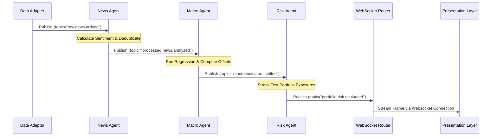

# Architectural Redesign Blueprint: Agent-Driven Modular Bloomberg-Style Terminal (OpenTerminal)

This document outlines the system redesign specification to transform **OpenTerminal** from a decoupled client-server prototype into a fully modular, plugin-based, event-driven **Economic Swarm Intelligence Platform**. 

---

## 1. High-Level Architecture
The proposed architecture transitions the terminal from a traditional REST/WS model to an **Event-Driven Modular Agent Monolith** (or microservices, depending on deployment choices). The core goal is complete decoupling: **no module imports code from any other module**, and all business logic is handled by autonomous agent services communicating via an **Event Bus**.

```
┌────────────────────────────────────────────────────────────────────────┐
│                        Presentation Layer (Next.js)                    │
│   ┌──────────────┐  ┌──────────────┐  ┌──────────────┐  ┌──────────┐   │
│   │ Investor UI  │  │ Economist UI │  │  Student UI  │  │ Research │   │
│   └──────┬───────┘  └──────┬───────┘  └──────┬───────┘  └────┬─────┘   │
└──────────┼─────────────────┼─────────────────┼───────────────┼────────┘
           │                 │ WebSocket       │               │
           ▼                 ▼                 ▼               ▼
┌────────────────────────────────────────────────────────────────────────┐
│                          API Gateway & Routing                         │
│                  (Dynamic FastAPI Module Route Registry)               │
└───────────────────────────────────┬────────────────────────────────────┘
                                    │ task dispatch
                                    ▼
┌────────────────────────────────────────────────────────────────────────┐
│                         AI Supervisor Agent                            │
│                 (Task Parser, Swarm Planner, Synthesizer)              │
└──────────┬───────────────────────────────────────────────────▲─────────┘
           │ publish job                                       │ return
           ▼                                                   │ synthesis
┌──────────────────────────────────────────────────────────────┴─────────┐
│                                Event Bus                               │
│  (In-Memory Redis Pub/Sub, RabbitMQ, or AsyncIO Event Loop Broker)      │
└──────────┬───────────────────▲───────────────────┬───────────▲─────────┘
           │ subscribe         │ publish           │ subscribe │ publish
           ▼                   │                   ▼           │
┌──────────────────────────────┴┐       ┌──────────────────────┴────────┐
│     News Intelligence Agent   │       │       Forecasting Agent       │
│  - Sentiment Analyzer         │       │  - Time-series modeling       │
│  - Deduplicator               │       │  - Prophet, LSTM adapters     │
└───────────────────────────────┘       └───────────────────────────────┘
┌───────────────────────────────┐       ┌───────────────────────────────┐
│     Macro Analysis Agent      │       │     Knowledge Graph Agent     │
│  - Shock Propagation Solver   │       │  - Shortest Path Finder       │
│  - Sector Multiplier Solver   │       │  - Causal Network Mapper      │
└───────────────────────────────┘       └───────────────────────────────┘
                                    ...
┌────────────────────────────────────────────────────────────────────────┐
│                           Unified Data Layer                           │
│  ┌─────────────────┐ ┌─────────────────┐ ┌─────────────────┐ ┌───────┐ │
│  │ yfinance Adapter│ │  FRED Adapter   │ │WorldBank Adapter│ │  RSS  │ │
│  └─────────────────┘ └─────────────────┘ └─────────────────┘ └───────┘ │
└────────────────────────────────────────────────────────────────────────┘
```

### Decoupling Mechanism
* **Presentation**: Renders only. Components read configuration schemas containing endpoints, actions, and websocket topics. The UI is completely agnostic of which LLM, database, or mathematical solver handles the logic.
* **Agent Layer**: Agents are self-contained background executors. They do not have REST routers or direct REST handlers. Instead, they run in isolated event listeners subscribing to message schemas (e.g. `GeopoliticalShockEvent`) and publish output schemas (e.g. `PortfolioRebalanceAlert`).
* **Adapters**: The Data Layer wraps all external APIs (Yahoo Finance, FRED, RSS) in unified interfaces. Agents request raw data keys (e.g., `economic_indicator.india.cpi`) without knowing which adapter fetched it or whether it came from cache.

---

## 2. Folder Structure
The file structure is organized around **independent plugin modules** under the `/modules` folder.

```
OpenTerminal/
├── backend/
│   ├── app/
│   │   ├── core/                           # Core Terminal Framework (Global)
│   │   │   ├── boot.py                     # Module loader and route discovery
│   │   │   ├── config.py                   # Pydantic Settings base
│   │   │   ├── container.py                # Dependency injection container
│   │   │   ├── event_bus.py                # Abstract & concrete Event Bus broker
│   │   │   └── supervisor.py               # Cognitive orchestrator LLM wrapper
│   │   │
│   │   ├── modules/                        # Plugins Directory
│   │   │   ├── base.py                     # Abstract Base Module class interface
│   │   │   │
│   │   │   ├── news/                       # Decoupled News Intelligence Module
│   │   │   │   ├── api/                    # REST HTTP Endpoints
│   │   │   │   ├── agents/                 # News Sentiment Agent Service
│   │   │   │   ├── models/                 # Article & Event database schemas
│   │   │   │   ├── config.py               # News-specific keys & variables
│   │   │   │   └── registry.py             # Entrypoint extending BaseModule
│   │   │   │
│   │   │   ├── forecast/                   # Decoupled Forecasting Module
│   │   │   │   ├── api/
│   │   │   │   ├── agents/                 # Time-series simulation agents
│   │   │   │   ├── models/
│   │   │   │   ├── config.py
│   │   │   │   └── registry.py
│   │   │   │
│   │   │   ├── data_pool/                  # Data Adapters Module
│   │   │   │   ├── adapters/               # FRED, yfinance, WorldBank, RSS
│   │   │   │   ├── models/
│   │   │   │   └── registry.py
│   │   │   └── ...                         # (portfolio, graph, risk, alerts, reports)
│   │   │
│   │   └── main.py                         # Framework startup entrypoint
│   └── requirements.txt
│
└── frontend/
    ├── src/
    │   ├── app/                            # Layout shell
    │   └── components/
    │       ├── core/                       # Global CommandBar, Toast notifications
    │       └── modules/                    # Component registers per plugin
    │           ├── news/
    │           ├── forecast/
    │           └── ...
```

---

## 3. Service Architecture & Dependency Injection
To achieve clean separation of concerns, services depend only on interfaces. We implement a **Dependency Injection (DI) Container** using `dependency-injector` or native FastAPI overrides to bind implementations.

### Service Interfaces
```python
# In backend/app/core/interfaces.py
from abc import ABC, abstractmethod
from typing import Dict, Any

class DataAdapter(ABC):
    @abstractmethod
    async def fetch_series(self, symbol: str, interval: str) -> Dict[str, Any]:
        """Fetch raw time series data from the provider."""
        pass

class EventBroker(ABC):
    @abstractmethod
    async def publish(self, topic: str, message: Dict[str, Any]) -> None:
        """Publish a message to the specified topic."""
        pass

    @abstractmethod
    async def subscribe(self, topic: str, handler) -> None:
        """Subscribe to a topic with a callback handler."""
        pass
```

### Dependency Injector Container
```python
# In backend/app/core/container.py
from dependency_injector import containers, providers
from backend.app.core.event_bus import RedisEventBus
from backend.app.modules.data_pool.adapters.yfinance import YFinanceAdapter

class Container(containers.DeclarativeContainer):
    config = providers.Configuration()

    # Event bus binding
    event_bus = providers.Singleton(
        RedisEventBus,
        redis_url=config.redis_url
    )

    # Data adapters mapping
    yfinance_adapter = providers.Singleton(YFinanceAdapter)
    # FRED, IMF, etc...
```

---

## 4. Agent Architecture
OpenTerminal Swarm utilizes a **Supervisor-Worker Agent Pattern**. The Supervisor parses the user request, plans tasks, executes them via events, and aggregates results.

```
                    [User Query]
                         │
                         ▼
             ┌───────────────────────┐
             │   Supervisor Agent    │
             └───────────┬───────────┘
                         │ (Plan & Route)
         ┌───────────────┼───────────────┐
         ▼               ▼               ▼
  ┌─────────────┐ ┌─────────────┐ ┌─────────────┐
  │ News Agent  │ │ Macro Agent │ │ Risk Agent  │
  └─────────────┘ └─────────────┘ └─────────────┘
```

### Supervisor Orchestrator implementation
```python
# In backend/app/core/supervisor.py
import json
from typing import Dict, Any
from backend.app.core.interfaces import EventBroker

class SupervisorAgent:
    def __init__(self, event_bus: EventBroker, llm_client):
        self.event_bus = event_bus
        self.llm = llm_client

    async def execute_task(self, prompt: str) -> Dict[str, Any]:
        """
        Parses a natural language instruction, determines which agents should execute,
        dispatches events to the broker, and compiles the final unified intelligence.
        """
        # 1. Plan parsing via LLM
        plan_prompt = (
            f"Given the user request: '{prompt}', decompose it into agent execution steps. "
            "Supported agents: 'news_sentiment', 'forecaster', 'macro_solver', 'portfolio_analyzer'. "
            "Return a JSON array of events to publish."
        )
        plan_response = await self.llm.generate(plan_prompt)
        steps = json.loads(plan_response) # e.g. [{"agent": "news_sentiment", "payload": {...}}]

        # 2. Asynchronous Event Dispatch
        for step in steps:
            event_name = f"agent.task.{step['agent']}"
            await self.event_bus.publish(event_name, step["payload"])

        # 3. Wait for completed events (via event tracking mechanism)
        results = await self.wait_for_results(steps)

        # 4. Synthesize outcomes
        synthesis = await self.llm.generate(f"Synthesize these agent outcomes: {json.dumps(results)}")
        return {"plan": steps, "results": results, "synthesis": synthesis}

    async def wait_for_results(self, steps) -> Dict[str, Any]:
        # Details of tracking and joining async events
        pass
```

---

## 5. Event Flow
To achieve decoupling, the system reacts to data triggers cascading through the Event Bus.



---

## 6. Module Dependency Graph
In this architecture, modules are flat siblings. They **must never import from each other**. They are only coupled to the shared `/core` module interfaces and events.

```
       ┌───────────────────────────┐
       │   backend.app.core        │◄──────────────────────────┐
       │   (Event Bus, Container)  │                           │
       └─────────────▲─────────────┘                           │
                     │ inherits / registers                    │
        ┌────────────┴───────────┬──────────────────┐          │
        ▼                        ▼                  ▼          │
 ┌─────────────┐          ┌─────────────┐    ┌─────────────┐   │
 │ modules.news│          │modules.macro│    │modules.risk │   │
 └──────┬──────┘          └──────┬──────┘    └──────┬──────┘   │
        │                        │                  │          │
        └────────────────────────┼──────────────────┘          │
                                 ▼                             │
                       [Unified Event Broker] ─────────────────┘
```

---

## 7. API Design
Each module registers its routing tree dynamically to the FastAPI main app.

### Dynamic Router Registration
```python
# In backend/app/modules/base.py
from abc import ABC, abstractmethod
from fastapi import APIRouter

class BaseModule(ABC):
    @abstractmethod
    def initialize(self) -> None:
        """Bootstraps module databases, event subscriptions, and resources."""
        pass

    @abstractmethod
    def register_routes(self) -> APIRouter:
        """Returns the module's router structure to be appended to the API Gateway."""
        pass
```

### Module Registration Hook
```python
# In backend/app/modules/news/registry.py
from fastapi import APIRouter
from backend.app.modules.base import BaseModule
from backend.app.modules.news.api import router as news_router
from backend.app.modules.news.agents.sentiment import NewsSentimentAgent

class NewsModule(BaseModule):
    def initialize(self) -> None:
        # Subscribe to raw news event topics
        sentiment_agent = NewsSentimentAgent()
        sentiment_agent.subscribe_topics()

    def register_routes(self) -> APIRouter:
        return news_router
```

---

## 8. Database Design
To preserve decoupling, **modules own their database tables**. Cross-module relational joins are strictly prohibited. Information joins must happen in memory via the Supervisor or events.

```
┌──────────────────────────────────────┐
│          News Database Schema        │
├───────────────────┬──────────────────┤
│ Field             │ Type             │
├───────────────────┼──────────────────┤
│ id (PK)           │ UUID             │
│ title             │ VARCHAR          │
│ sentiment_score   │ FLOAT            │
│ processed_at      │ TIMESTAMP        │
└───────────────────┴──────────────────┘

┌──────────────────────────────────────┐
│        Forecast Database Schema      │
├───────────────────┬──────────────────┤
│ Field             │ Type             │
├───────────────────┼──────────────────┤
│ id (PK)           │ UUID             │
│ target_variable   │ VARCHAR          │
│ forecasted_points │ JSONB            │
│ model_signature   │ VARCHAR          │
└───────────────────┴──────────────────┘
```

* **Persistence**: Handled via module-level migrations and schemas using SQLAlchemy or Tortoise ORM.

---

## 9. Message / Event Schemas
Events use strict validation schemas defined via Pydantic to ensure interface compliance.

```python
# In backend/app/core/events.py
from pydantic import BaseModel, Field
from datetime import datetime
from typing import Dict, Any

class BaseEvent(BaseModel):
    event_id: str = Field(..., description="Unique event identifier UUID")
    timestamp: datetime = Field(default_factory=datetime.utcnow)
    version: str = "1.0"

class NewsArrivedEvent(BaseEvent):
    source: str
    headline: str
    body_text: str

class MacroShiftEvent(BaseEvent):
    simulated_inputs: Dict[str, float] = Field(..., example={"oil": 120.0, "fed": 5.5})
    simulated_outputs: Dict[str, float] = Field(..., example={"cpi": 5.4, "gdp": 7.1})
```

---

## 10. Plugin Registration System
The Main Application dynamically scans the `/modules` folder at boot time, discovers module packages, imports them, and executes registration hooks.

```python
# In backend/app/core/boot.py
import importlib
import pkgutil
from fastapi import FastAPI
from backend.app.modules.base import BaseModule

def bootstrap_modules(app: FastAPI) -> None:
    """
    Scans app.modules, dynamically discovers and loads classes extending BaseModule.
    Registers endpoints and initializes internal background listeners.
    """
    import backend.app.modules as modules_pkg
    
    for _, module_name, ispkg in pkgutil.iterfind_modules(modules_pkg.__path__):
        if ispkg:
            # Dynamically import module registry module
            mod = importlib.import_module(f"backend.app.modules.{module_name}.registry")
            # Find class subclasses BaseModule
            for attr in dir(mod):
                cls = getattr(mod, attr)
                if isinstance(cls, type) and issubclass(cls, BaseModule) and cls is not BaseModule:
                    # Instantiate and register
                    module_instance = cls()
                    module_instance.initialize()
                    
                    # Mount API routes
                    router = module_instance.register_routes()
                    app.include_router(router, prefix="/api/v1")
                    print(f"Successfully registered and initialized Module: {module_name}")
```

---

## 11. Configuration Strategy
Each module defines its configuration settings class, preventing a single bloated configuration class from coupling the entire terminal.

```python
# In backend/app/modules/forecast/config.py
from pydantic_settings import BaseSettings

class ForecastSettings(BaseSettings):
    forecast_confidence_level: float = 0.95
    model_retrain_interval_hours: int = 24
    
    class Config:
        env_prefix = "TERMINAL_FORECAST_"
```

---

## 12. Dependency Injection Strategy
Dynamic service resolution is decoupled from FastAPI route signatures. Instead, route handlers query the DI container directly.

```python
# In backend/app/modules/news/api.py
from fastapi import APIRouter, Depends
from backend.app.core.container import Container

router = APIRouter(prefix="/news", tags=["News"])

@router.get("/sentiment")
async def get_sentiment(
    symbol: str, 
    sentiment_agent = Depends(lambda: Container.event_bus()) # Inject interface
):
    # Route logic
    pass
```

---

## 13. Background Worker Architecture
To handle long-running operations (such as regression sweeps, forecasting calculations, and model updates) without blocking API response threads, task execution is delegated to **Celery/ARQ workers**.

```
[FastAPI Route Handler] ────► [Enqueues Job] ────► [Redis Broker Queue]
                                                         │
                                                         ▼
[FastAPI REST Response] ◄─── [Returns JobID]     [Celery Worker Swarm]
                                                - News analysis
                                                - Prophet sweeps
                                                - PDF generation
```

---

## 14. Scheduler Architecture
Periodic operations (e.g. checking RSS feeds every 10 minutes, updating yfinance snapshots) are handled by a dedicated scheduler (e.g., **Celery Beat** or **APScheduler**) running in a separate daemon thread to ensure reliability.

```python
# In backend/app/core/scheduler.py
from apscheduler.schedulers.asyncio import AsyncIOScheduler
from backend.app.core.container import Container

scheduler = AsyncIOScheduler()

@scheduler.scheduled_job('interval', minutes=15)
async def poll_macro_indicators():
    """Poll economic indicators daily from FRED, IMF, and World Bank."""
    event_bus = Container.event_bus()
    await event_bus.publish("scheduler.trigger.macro_poll", {})
```

---

## 15. Deployment Architecture
The platform is packaged into containerized services running on **Kubernetes** to enable independent scaling and isolation:

* **Frontend Pods**: Next.js Node server (scales on CPU metrics).
* **API Gateway Pods**: FastAPI servers exposing HTTP endpoints.
* **Supervisor Agent Pods**: Specialized instances running LLM orchestrations.
* **Worker Swarm Pods**: Celery nodes running mathematical and NLP calculations.
* **Redis Pod**: Event broker & cache.

---

## 16. Scaling Strategy
* **Horizontal Scaling (HPA)**: Scale API Gateway pods independently from Swarm Worker pods. The worker pods can scale up during global economic shock periods (heavy slider changes) and scale down when traffic normalizes.
* **Database Scaling**: Each module has its own DB pool, isolating database connection bottlenecks (e.g., heavy writing of live market ticks does not slow down news sentiment lookups).

---

## 17. Failure Recovery Strategy
* **Dead Letter Queues (DLQ)**: If the Forecast Agent fails (e.g. due to an LSTM matrix error), the event is routed to a DLQ (`forecast.dlq`) and a notification is dispatched to the Alert Agent.
* **Circuit Breakers**: Implemented on all external API adapters (FRED, yfinance). If a provider goes down, the circuit opens and the adapter falls back immediately to cached snapshots without throwing HTTP `500` errors.

---

## 18. Security Considerations
* **Role-Based Access Control (RBAC)**: Presentation layers request authentication tokens before connecting to WS endpoints.
* **Prompt Injection Defense**: The Supervisor Agent uses structural validation (JSON schemas) on LLM outputs. User inputs are sanitized before being passed to LLM prompts, preventing arbitrary shell command injection.

---

## 19. Migration Plan
To minimize downtime, migrate from the current monolithic structure to the new modular architecture in phases:

```
[Monolithic Base]
       │
       ├─► Step 1: Extract Core Layers (Event Bus, Configuration)
       │
       ├─► Step 2: Extract Data Adapters (yfinance, IMF)
       │
       ├─► Step 3: Decouple Services into Modules (News, Forecast, Macro)
       │
       └─► Step 4: Integrate Supervisor Swarm & Dynamic Routing
```

---

## 20. Step-by-Step Implementation Roadmap

### Phase 1: Core Framework Setup (Weeks 1-2)
1. Initialize the new workspace folder structure.
2. Define the Pydantic Event schemas and configure the asyncio/Redis Event Bus.
3. Configure the Dependency Injection container.
4. Implement the plugin registry loader in `core/boot.py`.

### Phase 2: Data Adapters Decoupling (Weeks 3-4)
1. Move `market_data_service` into `/modules/data_pool` and refactor it to implement the unified `DataAdapter` interface.
2. Add adapters for FRED, World Bank, and IMF.
3. Decouple yfinance thread executions into isolated background tasks.

### Phase 3: Module Decoupling (Weeks 5-8)
1. Decouple the News, Forecast, Macro, and Knowledge Graph services into individual self-contained modules.
2. Set up SQLAlchemy bindings within each module, eliminating cross-module relational references.
3. Subscribe each module's agents to their respective topics on the Event Bus.

### Phase 4: Swarm Integration (Weeks 9-10)
1. Implement the `SupervisorAgent` with task planning parsing logic.
2. Hook up the API Gateway router to delegate incoming terminal tasks to the Supervisor.
3. Integrate the Celery background worker system.

### Phase 5: Verification & Production Deployment (Weeks 11-12)
1. Write integration test suites to verify event cascades (e.g., NewsArrived -> MacroShift).
2. Configure Docker containers and write Kubernetes manifests.
3. Deploy to staging, verify WebSocket stream latencies, and transition users.
